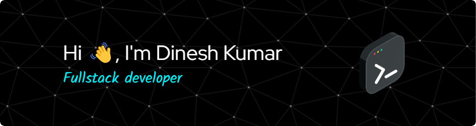

## 🚀 About Me  

I am a results-driven software developer currently pursuing a Master of Computer Applications at NIT Raipur. My academic foundation was solidified at the University of Delhi, where I graduated with a 9.54 CGPA and secured the First Position in my Computer Science bachelor's program.

I specialize in full-stack development using technologies like TypeScript, React, and Node.js. During my internship at Optum (UnitedHealth Group), I gained hands-on experience developing an AI-driven code migration tool using RAG and LLMs and optimizing full-stack applications for scalability and performance.

My passion for tackling complex challenges is evidenced by my Knight (top 5%) rank on LeetCode. I am always eager to learn and apply cutting-edge technologies to create efficient, high-impact software solutions.

📄 Check out my resume here: **[Click To View](https://drive.google.com/drive/folders/1yiitjehba_xZ8NHvCUay_52XJGVRcqvo)**  

---

## 🔥 Tech Stack  

🚀 **Languages:** Java, C++, JavaScript, TypeScript  
🖥 **Frontend:** React, TailwindCSS, Bootstrap  
🛠 **Backend:** Node.js, Express, MongoDB, MySQL, PostgreSQL  
⚡ **DevOps & Tools:** Git, Docker, AWS, Nginx, Postman

  

---

## 🎯 Coding Profiles   

  
  
  

---

## 📶 GitHub Stats  

  
   
  
  

---

## 📫 Connect with Me  

  

_Or Reach Me at_

📧 Email: d3012kumar@gmail.com 

---
⭐ **Let's connect and collaborate on exciting projects!** 🚀   
